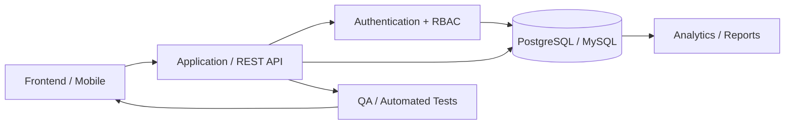

<!-- ========================================================= -->

<!--                     HERO / HEADER                         -->

<!-- ========================================================= -->

<div align="center">


<a href="https://readme-typing-svg.demolab.com">

</a>

<br/>

<a href="https://cornelio-portfolio.vercel.app/">

</a>
<a href="https://linkedin.com/in/corneliogatbonton">

</a>
<a href="mailto:corneliogatbontonjr21@gmail.com">

</a>

</div>

---

## `> whoami`

```text
Cornelio A. Gatbonton Jr.
Software Engineer / Full-Stack Developer
Manila, Philippines

Primary focus  → Web & Mobile Engineering
Secondary      → Software QA & Test Automation
Experience     → Development · Testing · Technical Support
```

BS Information Technology graduate with hands-on experience building and testing
real-world **web and mobile applications**.

I work across the software lifecycle — from translating requirements into UI and
database workflows to implementing features, testing edge cases, investigating
defects, and improving production-ready interfaces.

My strongest areas are **React ecosystems, TypeScript, relational databases,
application testing, authentication/RBAC, responsive interfaces, and
full-stack business systems.**

---

## `> engineering_profile`

<table>
<tr>
<td width="33%" valign="top">

### ⚡ Build

Next.js
React
TypeScript
JavaScript
PHP
React Native / Expo
Tailwind CSS
shadcn/ui

</td>
<td width="33%" valign="top">

### 🧪 Test

Playwright
Manual QA
Functional Testing
Regression Testing
Smoke Testing
UAT
UI Testing
Test Case Design

</td>
<td width="33%" valign="top">

### ⚙️ Engineer

REST APIs
RBAC
Authentication
CRUD Systems
PostgreSQL
MySQL
Supabase
Git / Agile

</td>
</tr>
</table>

---

## `> stack --primary`

<div align="center">


</div>

### Current engineering focus

```ts
const currentFocus = {
  frontend: ["Next.js", "React", "TypeScript", "Tailwind CSS", "shadcn/ui"],
  mobile: ["Expo", "React Native"],
  backend: ["REST APIs", "PHP", "Node.js"],
  database: ["PostgreSQL", "MySQL", "Supabase"],
  architecture: ["RBAC", "Authentication", "Relational Data Modeling"],
  quality: ["Playwright", "Functional Testing", "Regression Testing", "UAT"],
  workflow: ["Git", "GitHub", "Agile", "Scrum"],
};
```

---

# `> featured_projects`

<table>
<tr>
<td width="50%" valign="top">

## 🩸 BloodNetwork.net

**Web + Mobile Healthcare Platform**

`Next.js` `React` `TypeScript`
`Supabase` `PostgreSQL` `Expo`

Developed production-oriented web and mobile workflows for a nonprofit healthcare platform.

**Engineering highlights**

↳ Authentication & role-based access control
↳ Responsive reusable UI components
↳ Donor and event management workflows
↳ Database-driven operational processes
↳ Analytics dashboards and charts
↳ Automated system-generated reports
↳ Web + React Native development

<a href="https://cornelio-portfolio.vercel.app/">
<strong>View project →</strong>
</a>

</td>
<td width="50%" valign="top">

## ☕ Smart POS System

**Multi-role Point-of-Sale Platform**

`PHP` `MySQL` `JavaScript`
`Tailwind CSS` `Chart.js`

Designed and developed a transaction-focused POS platform with administrative and analytics capabilities.

**Engineering highlights**

↳ Multi-role application architecture
↳ Ordering and transaction workflows
↳ Relational database design
↳ Sales analytics dashboard
↳ System testing
↳ Technical documentation

<a href="https://cornelio-portfolio.vercel.app/">
<strong>View project →</strong>
</a>

</td>
</tr>

<tr>
<td width="50%" valign="top">

## 🚗 Car Rental System

**Booking & Fleet Management Platform**

`PHP` `MySQL` `JavaScript`
`Tailwind CSS` `Chart.js`

Full-stack management system built for reservations, fleet operations, transactions, and reporting.

**Engineering highlights**

↳ Reservation workflows
↳ Vehicle inventory management
↳ Administrative dashboard
↳ Analytics and reporting
↳ Email notifications
↳ Relational database design

<a href="https://cornelio-portfolio.vercel.app/">
<strong>View project →</strong>
</a>

</td>
<td width="50%" valign="top">

## 📱 Mobile Engineering

**React Native / Expo Applications**

`Expo` `React Native` `TypeScript`
`Supabase`

Building mobile experiences connected to shared application data and backend services.

**Engineering highlights**

↳ Cross-platform application development
↳ Event booking workflows
↳ Donation history
↳ Backend integration
↳ Responsive mobile UI
↳ Authentication workflows

<a href="https://cornelio-portfolio.vercel.app/">
<strong>Explore my work →</strong>
</a>

</td>
</tr>
</table>

---

## `> quality_engineering`

One thing that separates my development background from a typical junior developer profile is my experience working on **both sides of software delivery: implementation and verification.**

```text
┌──────────────────────────────────────────────────────────┐
│ QUALITY ENGINEERING                                      │
├──────────────────────────────────────────────────────────┤
│ 700+        QA test cases designed and executed          │
│                                                          │
│ Coverage     RBAC · UI · Validation · E2E workflows      │
│ Testing      Functional · Regression · Smoke · UAT       │
│ Automation   Playwright                                  │
│ Workflow     Reproduce → Document → Fix → Verify         │
└──────────────────────────────────────────────────────────┘
```

<details>
<summary><b>🔎 View testing capabilities</b></summary>

<br/>

I have practical experience designing and executing test cases for:

* Authentication and authorization
* Role-based access control
* Form validation
* Responsive interfaces
* CRUD operations
* Database-backed workflows
* End-to-end user journeys
* Regression scenarios
* Negative and edge-case testing
* User Acceptance Testing
* Defect reproduction and verification

My development workflow considers testability, maintainability, validation,
error handling, and user experience—not only whether a feature compiles.

</details>

---

## `> architecture_interests`



I particularly enjoy working on systems involving **business workflows,
role-based applications, dashboards, relational data, forms, authentication,
and operational automation.**

---

## `> more_about_my_toolbox`

<details>
<summary><b>🖥️ Frontend Engineering</b></summary>

<br/>

`React` · `Next.js` · `Vue.js` · `TypeScript` · `JavaScript` · `HTML5` ·
`CSS3` · `Tailwind CSS` · `Bootstrap` · `shadcn/ui` · `Chart.js`

Focus areas include component architecture, responsive interfaces,
dashboard development, forms, application states, data visualization,
and reusable UI systems.

</details>

<details>
<summary><b>🗄️ Backend & Data</b></summary>

<br/>

`PHP` · `Node.js` · `REST APIs` · `PostgreSQL` · `MySQL` · `Supabase`

Experience includes relational database modeling, authentication,
authorization, CRUD operations, database-backed workflows, API integration,
and reporting systems.

</details>

<details>
<summary><b>🧪 Software Quality</b></summary>

<br/>

`Playwright` · `Manual QA` · `Functional Testing` · `Regression Testing` ·
`Smoke Testing` · `UAT` · `UI Testing` · `Bug Tracking`

I approach testing from both a QA and developer perspective:
understanding expected behavior, reproducing failures, tracing likely causes,
documenting defects, implementing fixes, and verifying regression impact.

</details>

<details>
<summary><b>🛠️ Developer Environment</b></summary>

<br/>

`Git` · `GitHub` · `VS Code` · `Cursor` · `Claude` · `OpenAI Codex` ·
`XAMPP` · `Obsidian`

I use AI-assisted development as an engineering accelerator for debugging,
code exploration, documentation, test generation, and implementation while
still validating outputs through testing and code review.

</details>

---

# `> github_metrics`

<div align="center">


</div>

<div align="center">


</div>

---

## `> contribution_log`

<div align="center">


</div>

---

## `> status`

```yaml
name: Cornelio A. Gatbonton Jr.
role:
  - Software Engineer
  - Full-Stack Developer
  - QA-minded Developer

location: Manila, Philippines

interests:
  - Full-Stack Engineering
  - Frontend Engineering
  - Software Quality
  - Mobile Development
  - Database Systems
  - Developer Tooling

principle: "Build it. Test it. Understand it. Improve it."
```

---

<div align="center">

### Let's build something useful.

<a href="https://cornelio-portfolio.vercel.app/"><b>Portfolio</b></a>
  •   <a href="https://linkedin.com/in/corneliogatbonton"><b>LinkedIn</b></a>
  •   <a href="mailto:corneliogatbontonjr21@gmail.com"><b>Email</b></a>

<br/><br/>


<br/><br/>

<sub>
Built with curiosity, tested with intent.
</sub>

</div>
